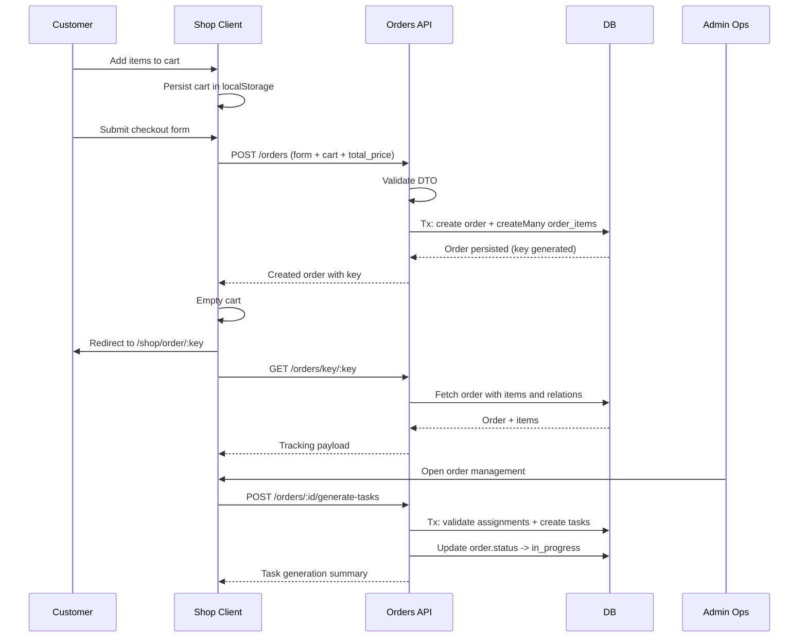

# Ordering Flow Analysis

Last updated: 2026-04-17

## Scope

This document analyzes the current customer ordering flow end-to-end across:

- Shop client experience (catalog -> cart -> checkout -> status tracking)
- API order creation and retrieval
- Admin fulfillment handoff (order -> print task generation)

## Design Summary

The ordering system is intentionally split into two planes:

1. Customer plane
- Browse products, manage cart, submit order, track status via order key
- Public order submission and key-based tracking endpoints

2. Admin/fulfillment plane
- Manage orders, inspect items, assign printers, generate print tasks
- Role-protected endpoints and task lifecycle integration

This keeps customer ordering simple while still allowing operational workflows to evolve independently.

## Primary Components

### Client (Shop)

- Cart state and persistence: [client/src/shop/pages/shared/ShopContext.tsx](client/src/shop/pages/shared/ShopContext.tsx)
- Cart UI: [client/src/shop/pages/cart/CartPage.tsx](client/src/shop/pages/cart/CartPage.tsx)
- Checkout UI and submit: [client/src/shop/pages/cart/CheckoutPage.tsx](client/src/shop/pages/cart/CheckoutPage.tsx)
- Order status page by key: [client/src/shop/pages/order-tracking/OrderStatusPage.tsx](client/src/shop/pages/order-tracking/OrderStatusPage.tsx)
- Order API hooks: [client/src/shared/features/orders/ordersApi.ts](client/src/shared/features/orders/ordersApi.ts)
- Shared API base path and auth header handling: [client/src/shared/lib/baseApi.ts](client/src/shared/lib/baseApi.ts)

### API (Orders)

- Orders controller and access policy: [api/src/modules/orders/orders.controller.ts](api/src/modules/orders/orders.controller.ts)
- Orders business logic: [api/src/modules/orders/orders.service.ts](api/src/modules/orders/orders.service.ts)
- Create order DTO validation: [api/src/modules/orders/dto/CreateOrderDto.ts](api/src/modules/orders/dto/CreateOrderDto.ts)
- Global request validation setup: [api/src/main.ts](api/src/main.ts)
- Persistence models: [api/prisma/schema.prisma](api/prisma/schema.prisma)

## End-to-End Flow

## Phase 1: Cart Assembly (Client-side)

1. User adds items from catalog.
2. Cart records productId, variantId, quantity in shop context state.
3. Cart is persisted to localStorage and rehydrated on reload.
4. Cart UI resolves current product and variant metadata via product query.

Key design choice:
- Cart stores lightweight identifiers, not full product snapshots.
- Product details are resolved at render time, reducing stale payload risks but requiring product data availability for rich display.

## Phase 2: Checkout Submission (Client -> API)

1. Checkout page gathers identity and delivery fields.
2. Total is computed client-side from current product prices.
3. Client sends POST /orders with payload:
- first_name, last_name, email
- delivery_method, location (conditional in UI)
- total_price
- cart: list of { productId, variantId, quantity }
4. On success, cart is emptied and user is redirected to /shop/order/:key.

Relevant code:
- Submit logic: [client/src/shop/pages/cart/CheckoutPage.tsx](client/src/shop/pages/cart/CheckoutPage.tsx)
- Mutation contract: [client/src/shared/features/orders/ordersApi.ts](client/src/shared/features/orders/ordersApi.ts)

## Phase 3: Order Creation Transaction (API)

1. Controller accepts public POST /orders.
2. DTO validation enforces required fields and non-empty cart.
3. Service creates order with:
- status = pending
- key = generated tracking key
4. In a single Prisma transaction:
- create order row
- createMany order_item rows from cart
5. Returns created order (including key used by client redirect).

Relevant code:
- Endpoint: [api/src/modules/orders/orders.controller.ts](api/src/modules/orders/orders.controller.ts)
- Logic: [api/src/modules/orders/orders.service.ts](api/src/modules/orders/orders.service.ts)
- DTO: [api/src/modules/orders/dto/CreateOrderDto.ts](api/src/modules/orders/dto/CreateOrderDto.ts)

## Phase 4: Customer Order Tracking (Public)

1. User lands on /shop/order/:orderKey.
2. Client fetches GET /orders/key/:key.
3. API returns order with order_items and product/product_variant/image details.
4. UI renders summary, item lines, status badge, and shareable tracking link.

Relevant code:
- Page: [client/src/shop/pages/order-tracking/OrderStatusPage.tsx](client/src/shop/pages/order-tracking/OrderStatusPage.tsx)
- Query hook: [client/src/shared/features/orders/ordersApi.ts](client/src/shared/features/orders/ordersApi.ts)
- API retrieval: [api/src/modules/orders/orders.service.ts](api/src/modules/orders/orders.service.ts)

## Phase 5: Fulfillment Handoff (Admin)

1. Admin views order details and items.
2. Admin selects printers for eligible order items.
3. Client sends POST /orders/:id/generate-tasks with printer_assignments.
4. API validates assignments and printer ids.
5. API creates print_job tasks linked to each order_item in transaction.
6. If tasks were created, order status transitions to in_progress.

Relevant logic:
- Task generation in order service: [api/src/modules/orders/orders.service.ts](api/src/modules/orders/orders.service.ts)

## API Contract Notes

## Public endpoints used by customer flow

- POST /orders
- GET /orders/key/:key

## Role-protected endpoints used by operations

- GET /orders
- GET /orders/:id
- PATCH /orders/:id
- DELETE /orders/:id
- GET /orders/:id/items
- POST /orders/:id/items
- PATCH /orders/:id/items/:itemId
- DELETE /orders/:id/items/:itemId
- POST /orders/:id/generate-tasks

## Validation and Data Guarantees

- Nest global ValidationPipe is enabled: [api/src/main.ts](api/src/main.ts)
- Create order DTO requires email, names, delivery method, total price, and at least one cart item.
- Cart item DTO enforces positive integer identifiers and quantity.

Important practical implication:
- The API currently trusts client-sent total_price and cart price composition.
- There is no server-side recomputation of total from authoritative variant prices during createOrder.

## Status Lifecycle

## Order

Observed statuses in flow:

- pending: set at order creation
- in_progress: set after successful task generation
- additional statuses are supported by UI conventions (completed, cancelled, failed, etc.) as strings

## Order Item

- order_item.status defaults to pending in schema
- item status can be updated via admin order item update flow

## Task linkage

- Print tasks created from orders include details with order and item identifiers
- Unique-constraint handling is used to avoid duplicate task creation races in generation logic

## Persistence Model Design

See schema definitions in [api/prisma/schema.prisma](api/prisma/schema.prisma):

- order has a unique key field for public tracking
- order_item links order, product, product_variant, quantity, status
- order to order_item is one-to-many

Design impact:

- Tracking by key avoids exposing sequential IDs to customers.
- Strong relational links preserve product and variant references for fulfillment.

## Sequence Diagram

## Strengths of Current Design

1. Clear separation between customer checkout and admin fulfillment.
2. Public tracking uses key-based lookup instead of direct id exposure.
3. Transactional order + order item creation reduces partial-write risk.
4. Task generation is transactional and validates printer assignments.
5. Frontend uses cohesive RTK Query API contracts for cache invalidation.

## Gaps and Risks

1. Server does not recompute or validate pricing totals at createOrder.
2. Several payloads still use broad typing patterns in client and API (for example cart item typing on client mutation side).
3. findOrderByKey currently throws InternalServerErrorException for missing key instead of a not-found style response.
4. Some endpoints expose data with mixed role policy patterns that may need tightening over time.
5. Checkout and some related views still include inline style usage that can hinder consistency and maintainability.

## Recommended Next Design Iterations

1. Add authoritative server-side pricing recomputation and compare against client total.
2. Return explicit not-found semantics for invalid order keys.
3. Introduce explicit order status enum constraints at schema/API layer.
4. Strengthen typed DTO contracts for remaining loosely typed update/create payloads.
5. Add idempotency strategy for order submission to prevent accidental duplicate checkout posts.

## Quick Reference: Core Ordering Files

- [client/src/shop/pages/shared/ShopContext.tsx](client/src/shop/pages/shared/ShopContext.tsx)
- [client/src/shop/pages/cart/CartPage.tsx](client/src/shop/pages/cart/CartPage.tsx)
- [client/src/shop/pages/cart/CheckoutPage.tsx](client/src/shop/pages/cart/CheckoutPage.tsx)
- [client/src/shop/pages/order-tracking/OrderStatusPage.tsx](client/src/shop/pages/order-tracking/OrderStatusPage.tsx)
- [client/src/shared/features/orders/ordersApi.ts](client/src/shared/features/orders/ordersApi.ts)
- [api/src/modules/orders/orders.controller.ts](api/src/modules/orders/orders.controller.ts)
- [api/src/modules/orders/orders.service.ts](api/src/modules/orders/orders.service.ts)
- [api/src/modules/orders/dto/CreateOrderDto.ts](api/src/modules/orders/dto/CreateOrderDto.ts)
- [api/prisma/schema.prisma](api/prisma/schema.prisma)
